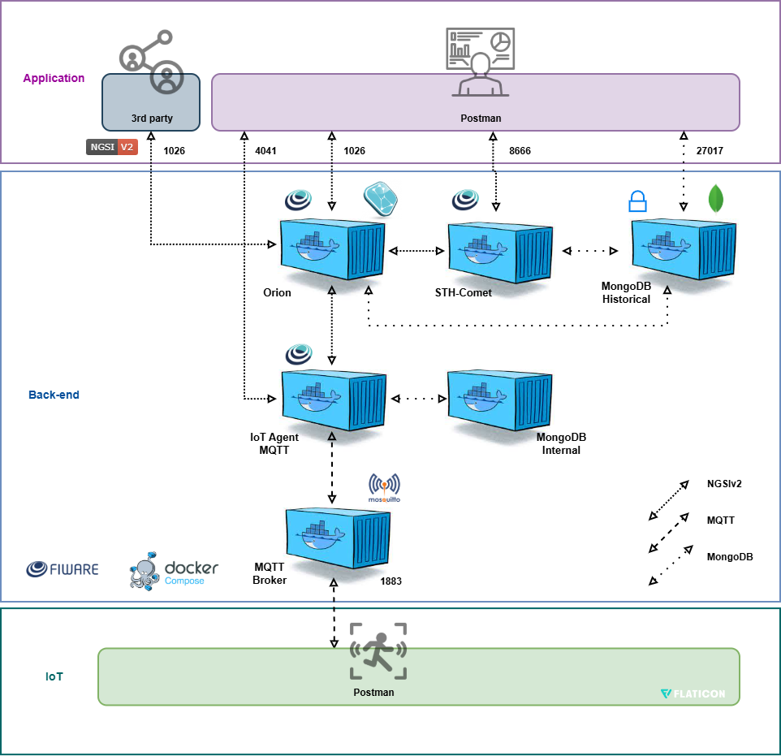

# Saúde em Foco IoT – Monitoramento Inteligente com FIWARE

## Visão Geral

Este projeto implementa uma **solução de IoT para monitoramento de presença em ambiente**, utilizando a plataforma **FIWARE** como middleware para gestão de contexto e armazenamento histórico.  
O sistema coleta **dados de um sensor ultrassônico e transforma em distância em centímetros**, e **aciona alerta visual** localmente e remotamente.  

Os dados são armazenados de forma persistente e podem ser analisados em tempo real ou historicamente através da API REST do **STH-Comet (porta 8666)**.

---

##  Arquitetura do Sistema

A arquitetura segue o padrão FIWARE NGSIv2 e integra os seguintes componentes:



---

## Hardware Utilizado

| Componente | Função | Pino ESP32 |
|-------------|---------|-------------|
| HC-SR04 | Sensor ultrassônico | GPIO 18 |
| LED Onboard Azul | Alerta visual piscante | GPIO 2 |

> Quando o parâmetro ultrapassar o limite, o **LED Azul acende**.

---

## Parâmetros de Operação

| Parâmetro | Faixa Ideal | Ação de Alerta |
|------------|-------------|----------------|
| Distância | > 75cm | LED: on |

---

## Cálculo da Distância do Sensor Ultrassônico

O sensor HC-SR04 mede o tempo total que o pulso ultrassônico leva para ir até o objeto e voltar.
A distância é calculada pela:

**Fórmula da distância:**

distância (cm) = ( t / 2 ) × 0.0343

Onde:

t = tempo medido pelo sensor (em microssegundos)

t / 2 = tempo apenas de ida do pulso

0.0343 cm/μs = velocidade do som no ar (343 m/s convertidos para cm/μs)

**Representação matemática**
distância = (t / 2) × 0.0343

---

## Software e Ferramentas

- **ESP32 + Arduino IDE (.ino)**
  - Publicação MQTT no tópico `/TEF/device001/attrs/d`
  - Formato de dados: UltraLight 2.0  
  - Comandos remotos `on/off` via Orion Context Broker
- **FIWARE Components (Docker Compose)**
  - Orion Context Broker
  - IoT Agent MQTT
  - Mosquitto
  - MongoDB (historical & internal)
  - STH-Comet
- **Postman**
  - Coleção: `GSpostmanCollection.json`
  - Inclui endpoints de **Health Check**, **Provisionamento de Dispositivo**, **Subscrição no Orion** e **Consulta Histórica via STH-Comet**

---

## Instalação e Execução

### 1. Configurar o Ambiente do FIWARE
> É recomendável usar **Docker Compose** padrão FIWARE.

```bash
docker compose up -d
```

### 2. Carregar os Dispositivos via Postman
1. Importar a coleção `GSpostmanCollection.json`
2. Executar as requisições na seguinte ordem:
   - Health Check do IoT Agent (`GET :4041/iot/about`)
   - Criar Service Group (`POST :4041/iot/services`)
   - Registrar dispositivo (`POST :4041/iot/devices`)
   - Criar subscrições no Orion (`POST :1026/v2/subscriptions`)
   - Validar leitura via STH (`GET :8666/STH/v1/contextEntities/...`)

### 3. Compilar o Código no ESP32
- Abrir o arquivo `arquivo.ino` na Arduino IDE
- Configurar:
  - **Board:** ESP32 Dev Module
  - **Port:** conforme detectado
- Upload e monitorar via Serial (115200)

---

## Evidências e Testes

- **Simulação Wokwi:** https://wokwi.com/projects/447997407261928449
- **Repositório GitHub:** https://github.com/Grego-Privado/GS-EDGE-2/edit/main/README.md
- **Coleção Postman:** `./GSpostmanCollection.json`
- **Vídeo PoC:** https://youtu.be/mTrRTYTdwSE

---

## 📘 Manual de Operação

1. Certifique-se de que todos os containers FIWARE estejam **em execução**.
2. Verifique se o **IoT Agent MQTT** está ativo (`GET :4041/iot/about`).
3. Garanta que o **ESP32** publique dados no tópico `/TEF/device001/attrs/`.
4. Monitore os valores e alertas no **dashboard web**.
5. Para resetar o sistema:
   - Delete o device via Postman (`DELETE /iot/devices/device001`)
   - Reprovisione o serviço.

---

